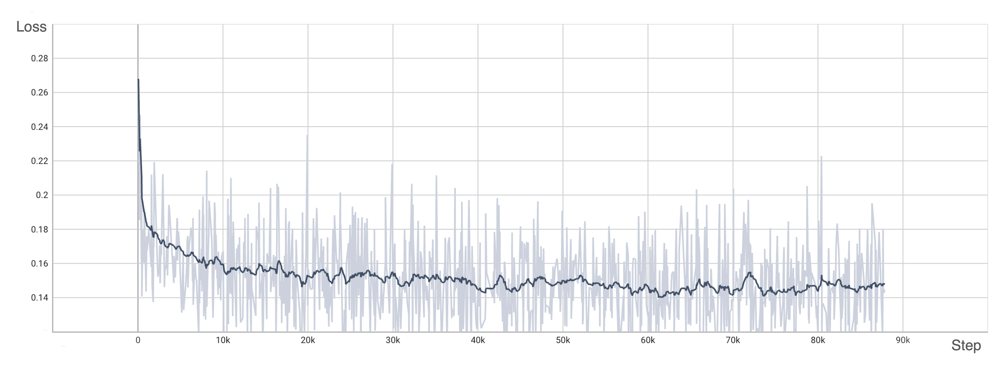

<p align="center">

</p>
<p align="center"><b><big>An Easy, Fast and Memory-Efficent System for DiT Training and Inference</big></b></p>
</p>
<p align="center"><a href="https://github.com/NUS-HPC-AI-Lab/OpenDiT">[Homepage]</a></p>
</p>

# About

OpenDiT is an open-source project that provides a high-performance implementation of Diffusion Transformer(DiT) powered by Colossal-AI. Specifically designed to enhance the efficiency of training and inference for DiT applications including text-to-video and text-to-image generation.

OpenDiT boasts the following characteristics:

1. Up to 80% speedup and 50% memory reduction on GPU
      * Kernel optimization including FlashAttention, Fused AdaLN, and Fused layernorm kernel.
      * Hybrid parallelism methods including ZeRO, Gemini, and DDP. And shard ema model to further reduce memory cost.
2. FastSeq: A novel sequence parallelism method
    * Sepcially designed for DiT-like workload where activation is large but parameter is small.
    * Up to 48% communication save for intra-node sequence parallel.
    * Break the memory limit of single GPU and reduce the overall training and inference time.
3. Ease of use
    * Huge performance gains with a few lines changes
    * You don't need to care about how the parallel part is implemented
4. Complete pipeline of text-to-image and text-to-video generation
    * User can easily use and adapt our pipeline to their own research without modifying the parallel part.
    * Verify the accuracy of OpenDiT with text-to-image training on ImageNet and release checkpoint.

<p align="center">

</p>

Authors: [Xuanlei Zhao](https://oahzxl.github.io/), [Zhongkai Zhao](https://www.linkedin.com/in/zhongkai-zhao-kk2000/), [Ziming Liu](https://maruyamaaya.github.io/), [Haotian Zhou](https://github.com/ht-zhou), [Qianli Ma](https://fazzie-key.cool/about/index.html), [Yang You](https://www.comp.nus.edu.sg/~youy/)

## Installation

Prerequisites:

-   Python >= 3.10
-   PyTorch >= 1.13 (We recommend to use a >2.0 version)
-   CUDA >= 11.6

We strongly recommend you use Anaconda to create a new environment (Python >= 3.10) to run our examples:

```shell
conda create -n opendit python=3.10 -y
conda activate opendit
```

Install ColossalAI:

```shell
git clone https://github.com/hpcaitech/ColossalAI.git
cd ColossalAI
git checkout adae123df3badfb15d044bd416f0cf29f250bc86
pip install -e .
```

Install OpenDiT:

```shell
git clone https://github.com/oahzxl/OpenDiT
cd OpenDiT
pip install -e .
```

(Optional but recommend) Install libraries for training & inference speed up:

```shell
# Install Triton for fused adaln kernel
pip install triton

# Install FlashAttention
pip install flash-attn

# Install apex for fused layernorm kernel
git clone https://github.com/NVIDIA/apex.git
cd apex
git checkout 741bdf50825a97664db08574981962d66436d16a
pip install -v --disable-pip-version-check --no-cache-dir --no-build-isolation --config-settings "--build-option=--cpp_ext" --config-settings "--build-option=--cuda_ext" ./ --global-option="--cuda_ext" --global-option="--cpp_ext"

```


## Usage

### Image

You can train the DiT model by executing the following command:

```shell
# Train the DiT model
bash train_img.sh
```

Here are details of some key arguments for training:
- `--plugin`: The booster plugin used by ColossalAI, `zero2` and `ddp` are supported.
- `--mixed_precision`: The data type for mixed precision training. The default value is `bf16`.
- `--grad_checkpoint`: Whether enable the gradient checkpointing. This saves the memory cost during training process. The default value is `False`.
- `--enable_modulate_kernel`: Whether enable the modulate kernel optimization. This speeds up the training process. The default value is `False`.
- `--enable_layernorm_kernel`: Whether enable the layernorm kernel optimization. This speeds up the training process. The default value is `False`.
- `--enable_flashattn`: Whether enable the FlashAttention. This speeds up the training process. The default value is `False`.
- `--sequence_parallel_size`: The sequence parallelism size. Will enable sequence parallelism when setting a value > 1. The defualt value is 1.
- `--sequence_parallel_type`: The sequence parallelism type you choose. The defualt value is `None`.

For more details of the configuration of the training process, please visit our code.

You can perform inference using DiT model by executing the following command. You need to replace the ckpt path to your trained or downloaded ema model ckpt.

```shell
# Inference using the trained DiT model
bash sample.sh
```

### Video
```
# train
bash preprocess.sh
bash train_video.sh
```

## FastSeq


In the realm of visual generation models, such as DiT, sequence parallelism is indispensable for effective long-sequence training and low-latency inference. The distinctive nature of these tasks can be summarized by two key features:
* Model parameter is small but sequence can be very long, making communication a bottleneck.
* As the model size is gerenally small, they only need sequence parallel within a node.

However, existing methods like DeepSpeed Ulysses and Megatron-LM Sequence Parallelism face limitations when applied to such tasks. They either introduce excessive sequence communication or lack efficiency in handling small-scale sequence parallelism.

To this end, we present FastSeq, a novel sequence parallelism for large sequences and small-scale parallelism. Our methodology focuses on minimizing sequence communication by employing only two communication operators for every transformer layer. We leverage AllGather instead of a group of AlltoAll for layer inputs to enhance communication efficiency, and we strategically employ an async ring to overlap AllGather communication with qkv computation, further optimizing performance.

Here are our experiments results, more results will be coming soon:


## DiT Reproduction Result

We have trained DiT using the origin method with OpenDiT to verify our accuracy. We have trained the model from scratch on ImageNet for 80k steps. And here are some results generated by our trained DiT:


Our loss also aligns with the results listed in the paper:



To reproduce our results, you need to change data to ImageNet in `train_img.py` and execute the following command:

```
torchrun --standalone --nproc_per_node=8 train_img.py \
    --model DiT-XL/2 \
    --batch_size 180 \
    --enable_layernorm_kernel \
    --enable_flashattn \
    --mixed_precision fp16
```


## Acknowledgement

## Contributing

If you encounter problems using OpenDiT, feel free to create an issue! We also welcome pull requests from the community.

## Citation
```
@misc{zhao2024opendit,
  author = {Xuanlei Zhao, Zhongkai Zhao, Ziming Liu, Haotian Zhou, Qianli Ma, and Yang You},
  title = {OpenDiT},
  year = {2024},
  publisher = {GitHub},
  journal = {GitHub repository},
  howpublished = {\url{https://github.com/NUS-HPC-AI-Lab/OpenDiT}},
}
```
